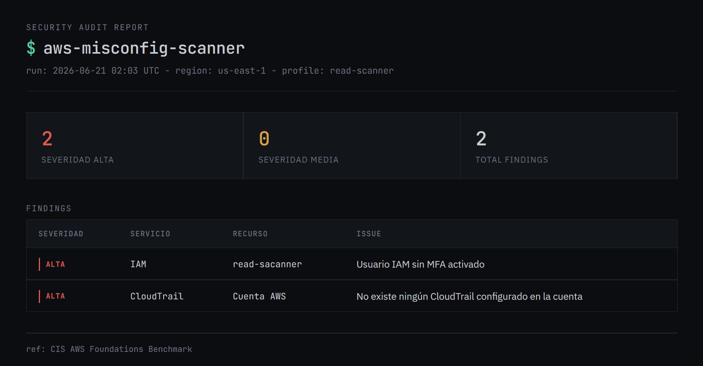

# aws-misconfig-scanner

Read-only AWS security audit tool. Scans S3, IAM, EC2, CloudTrail, and RDS for misconfigurations mapped to the CIS AWS Foundations Benchmark. No write permissions, no remediation: detection only.

## Motivation

Cloud compromises typically originate from misconfiguration rather than novel exploitation: public buckets, unrestricted security groups, IAM users without MFA. These conditions correspond to the Discovery phase in MITRE ATT&CK for Cloud, the enumeration an attacker performs after obtaining any foothold.

External attackers operate without API access initially. Public buckets are located through name enumeration; open ports through internet-wide scanning (Shodan, Nmap). IAM enumeration requires a foothold first, typically a leaked credential. Post-compromise, tooling such as Pacu or ScoutSuite automates the same enumeration this scanner performs defensively.

## Checks

| Service | Check | CIS Ref |
|---|---|---|
| S3 | Public bucket access | 2.1.5 |
| S3 | Default encryption disabled | 2.1.1 |
| IAM | Users without MFA | 1.10 |
| IAM | Access keys older than 90 days | 1.14 |
| IAM | Root account: no MFA / active access keys | 1.5 / 1.6 |
| EC2 | Security groups exposing sensitive ports to `0.0.0.0/0` | 5.2 / 5.3 |
| CloudTrail | Disabled, not multi-region, or no log validation | 3.1 |
| RDS | Publicly accessible instances | n/a |

EC2 check covers 50+ ports across remote administration, databases, directory services, and container orchestration APIs, weighted HIGH/MEDIUM by severity.

## Setup

```bash
git clone https://github.com/Light-MR/aws-misconfig-scanner.git
cd aws-misconfig-scanner
pip3 install boto3 --break-system-packages
```

Requires an IAM user scoped to the `SecurityAudit` managed policy. Root credentials are not used by this tool and should not be used to run it.

1. IAM → Create user → attach `SecurityAudit`
2. Generate an access key (CLI use case)
3. `aws configure`

## Usage

```bash
python3 main.py
```

Produces a console report, `scan_results.json`, and `scan_report.html`.

## Example output



Findings shown are from a sandbox account used for testing.

## Findings from development

AWS has enforced default SSE-S3 encryption on all buckets since 2023. The encryption check is correct but only triggers on pre-2023 buckets never migrated; it is not reproducible on a new account.

Console restrictions do not always reflect API restrictions. `delete-bucket-encryption` executes without error via CLI but does not alter bucket state, confirmed by re-querying `get-bucket-encryption`.

## Structure

```
aws-misconfig-scanner/
├── main.py
├── report.py
├── checks/
│   ├── s3_checks.py
│   ├── s3_encryption_checks.py
│   ├── iam_checks.py
│   ├── ec2_checks.py
│   ├── cloudtrail_checks.py
│   ├── rds_checks.py
│   └── root_account_checks.py
```

## Roadmap

- Lambda + EventBridge for scheduled, serverless execution
- Validation against CloudGoat scenarios
- SNS/email alerting on new findings

## Scope

Intended for auditing accounts the user owns or is explicitly authorized to test.

## License

MIT
